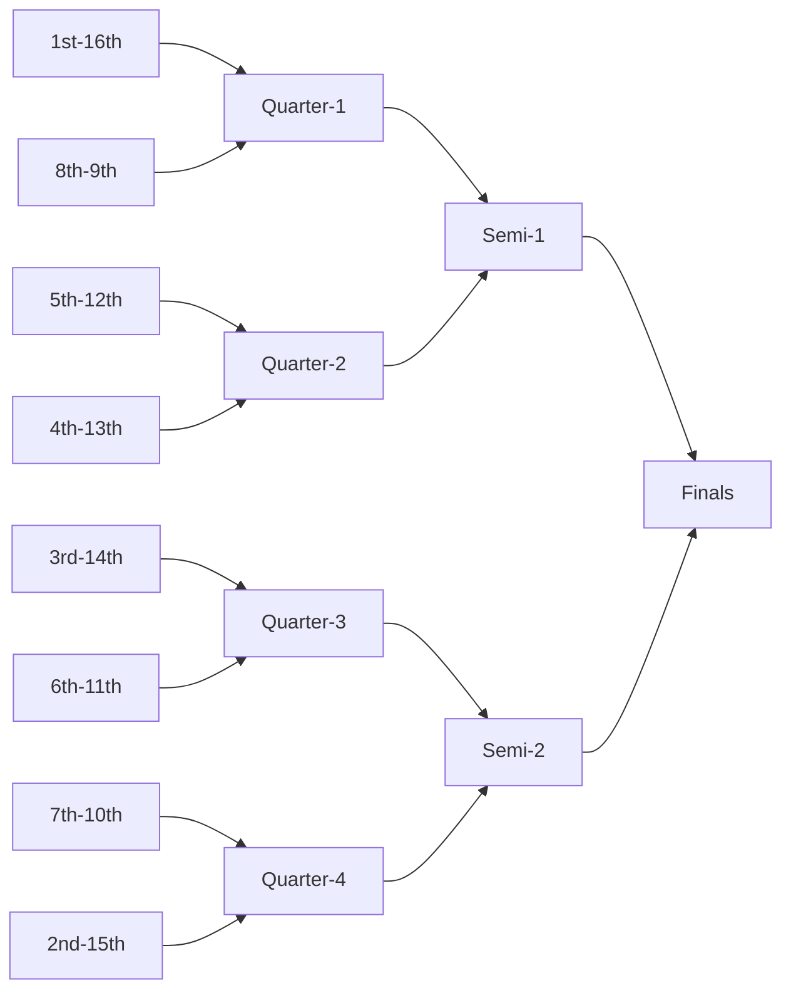

# General Rules
## Tour Structure
The overall structure of the tour is drafting, the main season ending with Playoffs. This year we have 30 teams, so we will be expecting to have:
- 1 week of drafting (starting W/C 17th June)
- 8 weeks of main season (starting W/C 24th June)
- 4 weeks of playoffs (starting W/C 19th August)

With 30 teams we will be splitting the teams into 3 divisions named Xerneas, Yveltal and Zygarde. Teams will draft and play the main season within these divisions before being brought back together in playoffs to crown one overall winner. Divisions are decided randomly as it is hard to predict year on year how a university will perform, however universities with multiple teams will be separated.
### Drafting

Before the draft starts, the draft order will

For the detailed rules regarding drafting please see the main set of rules [here](TeamTour/I-UPS%20Rules.md#Draft%20Rules)
### Main Season
The main season will run for 8 weeks

Each round of battles lasts 1 week, Monday to Sunday, and games should be played by 11:59pm Sunday BST. 
#### Scheduling
Each Saturday, prior to the start of each week, your team captain will inform the mod team who is playing which formats. Each matchup will then be **provided with a thread** each week to use for scheduling.

Battles are to be scheduled throughout the week. You should use your thread to schedule, but at a **minimum a time** should be posted here so we know you have scheduled. 

If you require an extension, it must  be **requested by the end of Friday**, unless there are exceptional circumstances. 
#### Battling
Each battle is best of one, except in Doubles where the format is bo3.

Games should be played using the specific battle format for your format on Showdown. 
- Paldea uses `Draft`
- Nat Dex uses `NatDex Draft`
- Low Tier uses `NatDex Draft`
- Doubles uses `VGC 2024 Reg F`
- Little Cup uses `NatDex LC Draft`

All battles are 6v6 except for Doubles which is bring 6, use 4. Pokémon must be level 100 in Paldea, Nat Dex and LT, level 50 in Doubles and level 5 in LC. 

Players may not forfeit mid-battle unless there is an emergency or a stall war occurs

In the case of an incomplete battle, a 0-3 loss may be given to one or both coaches depending on the effort made to schedule

After playing your game, you must post a replay link in the appropriate replay channel in the discord server.
### Playoffs
Playoffs will consist of a 4 week knockout bracket in the following format:
- Round of 16
- Quarter Finals
- Semi-Finals
- Finals

The teams that will progress to playoffs will be decided as follows:
- Top 4 Teams from each division
- The top four teams in the overall standings, that haven't otherwise qualified

Playoffs will be seeded based on the overall tournament standings as shown on the standings page. With 1st playing 16th, 2nd playing 15th and so on in the round of 16 as shown bellow:

## Formats
The formats, as decided via the poll, are as follows:
- Paldea Dex (DLC 2)
- National Dex aka Nat Dex
- Low Tier aka LT
- Doubles (VGC Regulation F, Bo3)
- Little Cup aka LC

Paldea Dex and Doubles are in SV formats, where as Nat Dex, LT and LC are all in Gen 9 National Dex format.
### Terastallization Rules
- Paldea Dex will use Tera Tax
- Nat Dex wil use Low Tier Tera
- Doubles will have Free Tera with Tera Preview

## Team Rules

### General requirements
For the tour we ask that you submit a team name as well as a logo. Logos should not be just a cropped box from a page and should free standing bit of work. (We are looking for logos we are able to put on stream without a lot of careful placement due to having a box round them.) If you have any queries, then please contact a moderator.
### Team Composition
This year we have made changes to how teams are teams are structures. Each team will consist of at least 5 players, with up to 8 total. 

Out of your potential 8 team members:
- at most 2 members may be alumni
- at most 2 members may be free agents
- at most 3 members of your team may be an alumni or a free agent
All team members must join the tour's Discord server to take part. 
### Team Captain
From your team, one player will be designated as team captain. They will be responsible for communicating with the tour moderators, managing your team, and ensuring any messages from the moderators are received by your team and understood. 
### Substitutes:
In previous years we have had teams assign substitutes. To follow on from the changes we made last year to allow players to change format week on week we will be removing the distinction between players and substitutes.

If a team has only 5 five players, players will be allowed to play multiple games in that week, though they can only play up to 2 games at most in a given week. This must be cleared with the mod team in advance of the game, if players are substituting excessively then you may be asked to find replacement players.